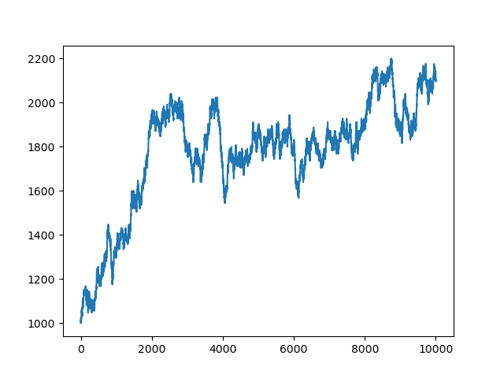

## Numpy作业

### 题目一

&emsp;&emsp;依照课件3中的内容给出测算三角波（triangle_wave（））y1、y2、y3、y4四种方式的计算速度与结果比较的代码，并对其运算显示结果。<br>
代码实现：

```python
import time
import numpy as np


def triangle_wave(x, c=0.6, c0=0.4, hc=1.0):
    x = x - int(x)
    if x >= c:
        r = 0.0
    elif x < c0:
        r = x / c0 * hc
    else:
        r = (c - x) / (c - c0) * hc
    return r


x = np.linspace(0, 2, 1000000)
start = time.process_time()
y1 = np.array([triangle_wave(t) for t in x])
print("y1 time:", time.process_time() - start)

triangle_ufunc1 = np.frompyfunc(triangle_wave, 4, 1)
start = time.process_time()
y2 = triangle_ufunc1(x, 0.6, 0.4, 1.0)
y2 = y2.astype(np.float64)
print("y2 time:", time.process_time() - start)

triangle_ufunc2 = np.frompyfunc(lambda i: triangle_wave(i, 0.6, 0.4, 1.0), 1, 1)
start = time.process_time()
y3 = triangle_ufunc2(x)
y3 = y3.astype(np.float64)
print("y3 time:", time.process_time() - start)

triangle_ufunc3 = np.vectorize(triangle_wave, otypes=[np.float64])
start = time.process_time()
y4 = triangle_ufunc3(x)
print("y4 time:", time.process_time() - start)
```

实验结果：

```
y1 time: 0.59375
y2 time: 0.25
y3 time: 0.28125
y4 time: 0.234375
```

### 题目二

&emsp;&emsp;arr11 = 5 - np.arange(1, 13).reshape(4, 3), 计算所有元素及每一列的和；对每一个元素、每一列求累积和；计算每一行的累计积；计算所有元素的最小值；计算每一列的最大值；计算所有元素、每一行的均值；计算所有元素、每一列的中位数；计算所有元素的方差，每一行的标准差。<br>
代码实现：

```python
import numpy as np

arr11 = 5 - np.arange(1, 13).reshape(4, 3)

sum_all = np.sum(arr11)
sum_row = np.sum(arr11, axis=1)
sum_col = np.sum(arr11, axis=0)
print("所有元素和:", sum_all)
print("每一行的和：", sum_row)
print("每一列的和：", sum_col)

cumsum_all = np.cumsum(arr11)
cumsum_row = np.cumsum(arr11, axis=1)
cumsum_col = np.cumsum(arr11, axis=0)
print("每个元素的累积和：", cumsum_all)
print("每一行的累积和：", cumsum_row)
print("每一列的累积和：", cumsum_col)

min_all = np.min(arr11)
max_col = np.max(arr11, axis=0)
print("所有元素的最小值：", min_all)
print("每一列的最大值：", max_col)

mean_all = np.mean(arr11)
mean_row = np.mean(arr11, axis=1)
print("所有元素的均值：", mean_all)
print("每一行的均值：", mean_row)

median_all = np.median(arr11)
median_col = np.median(arr11, axis=0)
print("所有元素的中位数：", median_all)
print("每一列的中位数：", median_col)

var_all = np.var(arr11)
std_row = np.std(arr11, axis=1)
print("所有元素的方差：", var_all)
print("每一行的标准差：", std_row)
```

实验结果：

```
所有元素和：-18

每一行的和：[  9   0  -9 -18]

每一列的和：[ -2  -6 -10]

每个元素的累积和：[  4   7   9  10  10   9   7   4   0  -5 -11 -18]

每一行的累积和：
[[  4   7   9]
 [  1   1   0]
 [ -2  -5  -9]
 [ -5 -11 -18]]
 
 每一列的累积和：
 [[  4   3   2]
 [  5   3   1]
 [  3   0  -3]
 [ -2  -6 -10]]
 
所有元素的最小值：-7

每一列的最大值：[4 3 2]

所有元素的均值：-1.5

每一行的均值：[ 3.  0. -3. -6.]

所有元素的中位数：-1.5

每一列的中位数：[-0.5 -1.5 -2.5]

所有元素的方差：11.916666666666666

每一行的标准差：[0.81649658 0.81649658 0.81649658 0.81649658]
```

### 题目三

&emsp;&emsp;在数组[1, 2, 3, 4, 5]中每相邻两个数字中间插入两个0。<br>
代码实现：

```python
import numpy as np

a = np.array([1, 2, 3, 4, 5])
a = np.insert(a, [1, 2, 3, 4], 0)
a = np.insert(a, [2, 4, 6, 8], 0)
print(a)
```

实验结果：

```
[1 0 0 2 0 0 3 0 0 4 0 0 5]
```

### 题目四

&emsp;&emsp;归一化，将矩阵规格化到0～1，即最小的变成0，最大的变成1，最小与最大之间的等比缩放。试对Z = np.random.random((5,5))进行归一化。<br>
代码实现：

```python
import numpy as np

z = np.random.random((5, 5))
max_z = np.max(z)
min_z = np.min(z)
z_norm = (z - min_z) / (max_z - min_z)
print(z_norm)
```

实验结果：

```
[[0.30423472 0.04814522 0.70006122 0.05231924 0.46879318]
 [0.24464478 0.7153423  1.         0.43115026 0.44971281]
 [0.82218341 0.5858797  0.61524078 0.3804148  0.16385332]
 [0.43697317 0.54965638 0.         0.44503508 0.07876655]
 [0.40095621 0.39440565 0.33282681 0.67513582 0.78560205]]
```

### 题目五

&emsp;&emsp;找出数组中与给定值最接近的数（通用方法）。（例：任一数组Z = array([[0, 1, 2, 3], [4, 5, 6, 7]])， 给任一定值z = 5.1，如何找出Z中的5）<br>
代码实现：

```python
import numpy as np

z = np.array([[0, 1, 2, 3], [4, 5, 6, 7]])
z0 = 5.1
# z0 = np.random.random()
gap = np.abs(z - z0)
ans_idx = np.where(gap == np.min(gap))
ans = z[ans_idx]
print(ans)
```

实验结果：

```
[5]
```

### 题目六

&emsp;&emsp;解方程：3x + 6y - 5z = 12；x - 3y + 2z = - 2；5x - y + 4z = 10。<br>
代码实现：

```python
import numpy as np

w = np.array([[3, 6, -5], [1, -3, 2], [5, -1, 4]])
b = np.array([12, -2, 10])
solution = np.linalg.solve(w, b)
print(solution)
```

实验结果：

```
[1.75 1.75 0.75]
```

### 题目七

&emsp;&emsp;参见课件4第45页，对g(y)在100个切比雪夫节点之上分別使用 Polynomial（Polynomial.fit）和Chebyshev（Chebyshev.fit）进行插值， 在[-1,1]区间上取1000个等距点对误差进行比较。g(x)= sin(z ** 2) + sin(z) ** 2, 其中z = (x - 1) * 5。<br>
代码实现：

```python
import numpy as np
from numpy.polynomial import Chebyshev, Polynomial


def g(x):
    z = (x - 1) * 5
    return np.sin(z ** 2) + (np.sin(z)) ** 2


xd = np.linspace(-1, 1, 1000)

n = 100
x = Chebyshev.basis(n).roots()
c1 = Polynomial.fit(x, g(x), n - 1, domain=[-1, 1])
c2 = Chebyshev.fit(x, g(x), n - 1, domain=[-1, 1])
print("Polynomial插值结果：", abs(c1(xd) - g(xd)).max())
print("Chebyshev插值结果：", abs(c2(xd) - g(xd)).max())
```

实验结果：

```
Polynomial插值结果： 1.1952231085476113
Chebyshev插值结果： 6.475768365987733e-09
```

### 题目八

&emsp;&emsp;试用bincount()函数替代histogram()函数完成统计男青少年年龄和身高的例子的计算（数据见height.csv）<br>
代码实现：

```python
import numpy as np
import pandas as pd

data = pd.read_csv("height.csv")
A = data["A"]
B = data["B"]
sums = np.bincount(A, weights=B)[7:]
cnts = np.bincount(A)[7:]
print(sums / cnts)
```

实验结果：

```
[125.96       132.06666667 137.82857143 143.8        148.14
 153.44       162.15555556 166.86666667 172.83636364 173.3
 175.275      174.19166667 175.075     ]
```

### 题目九

&emsp;&emsp;使用二项分布进行赌博计算. 同时抛弃5枚硬币，如果正面朝上少于3枚，则输掉8元，否则就赢8元。 如果手中有1000元作为赌资，请问赌博10000次后可能会是什么情况呢？(参见课件)<br>
代码实现：

```python
import numpy as np
import matplotlib.pyplot as plt

money_list = []
money = 1000
for i in range(10000):
    # if money < 0:
    #     break
    result = np.random.binomial(5, 0.5)
    if result < 3:
        money -= 8
    else:
        money += 8
    money_list.append(money)

plt.figure()
plt.plot(range(len(money_list)), money_list)
plt.show()
```

实验结果：
