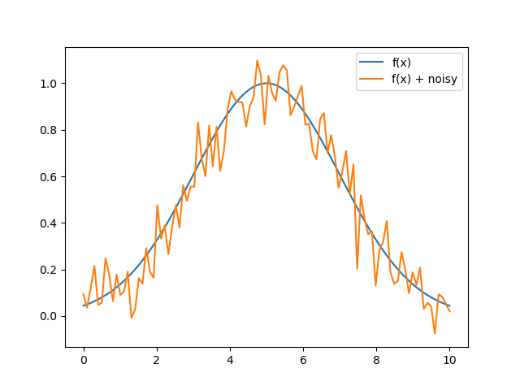
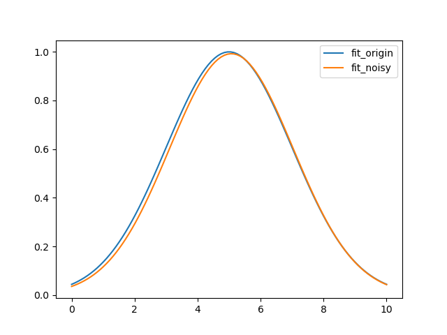
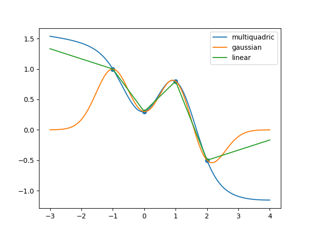
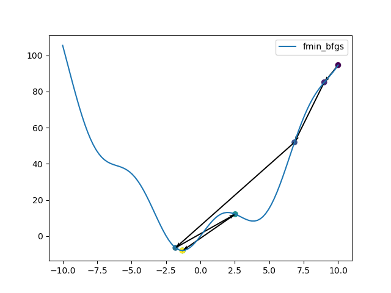
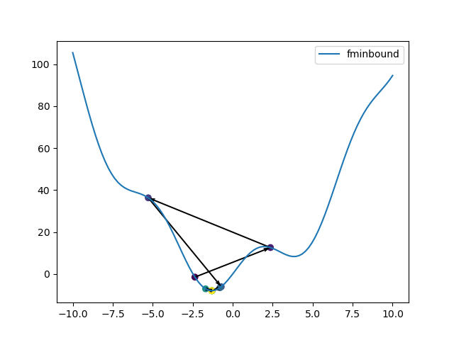
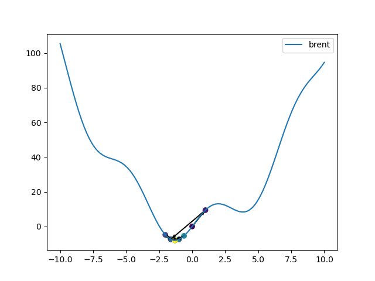
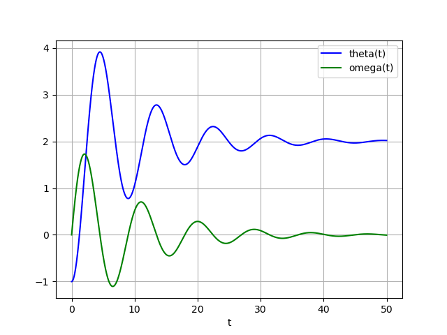
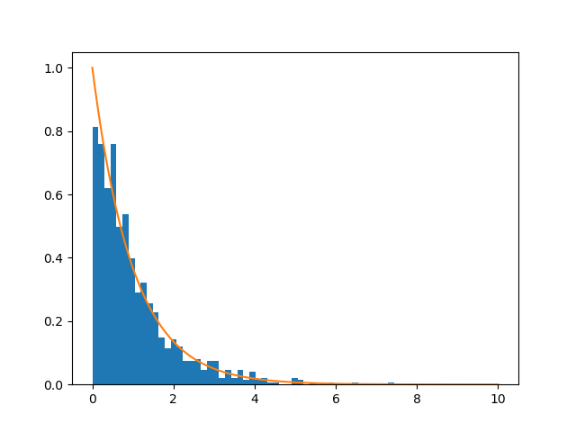

## Scipy作业

### 题目一

&emsp;&emsp;求解非线性方程组，cos(a) = 1 - d ^ 2 / (2 * r ^ 2) ，L = a * r，d = 140，L = 156;导入参数雅克比矩阵, 再次进行求解。<br>
代码实现：

```python
import math
import time
import numpy as np
from scipy.optimize import fsolve


def f(x):
    a, r = x
    d = 140
    l = 156
    return [math.cos(a) - 1 + d * d / (2 * r * r), l - a * r]


def derivative_f(x):
    a, r = x
    d = 140
    l = 156
    return [[-math.sin(a), -(d * d) / (r * r * r)], [-r, -a]]


x0 = np.array([1, 1])
result1 = fsolve(f, x0)
result2 = fsolve(f, x0, fprime=derivative_f)
print("不导入雅克比矩阵得到的解：{}".format(result1))
print("导入雅克比矩阵得到的解：{}".format(result2))

start = time.process_time()
for _ in range(100000):
    fsolve(f, x0)
print("不导入雅克比矩阵平均运算时间：{}".format((time.process_time() - start) / 100000))

start = time.process_time()
for _ in range(100000):
    fsolve(f, x0, fprime=derivative_f)
print("导入雅克比矩阵平均运算时间：{}".format((time.process_time() - start) / 100000))
```

实验结果：

```
不导入雅克比矩阵得到的解：[ 1.5940638  97.86308398]
导入雅克比矩阵得到的解：[ 1.5940638  97.86308398]
不导入雅克比矩阵平均运算时间：0.0002971875
导入雅克比矩阵平均运算时间：0.00029625
```

### 题目二

&emsp;&emsp;用curve_fit()函数对高斯分布进行拟合，xϵ[0,10],高斯分布函数为y=a * np.exp( - (x - b) ** 2 / (2 * c ** 2)) , 其中真实值a=1,b=5,c=2。试对y加入噪声之后进行拟合,并作图与真实数据进行比较。<br>
代码实现：

```python
from scipy.optimize import curve_fit
import numpy as np
import matplotlib.pyplot as plt


def f(x, a, b, c):
    return a * np.exp(-(x - b) ** 2 / (2 * c ** 2))


p0 = [1, 1, 1]
x0 = np.linspace(0, 10, 100)
y0 = f(x0, 1, 5, 2)
np.random.seed(42)
y1 = y0 + 0.1 * np.random.randn(len(x0))
p_origin, _ = curve_fit(f, x0, y0, p0=p0)
p_noisy, _ = curve_fit(f, x0, y1, p0=p0)
print("拟合结果：", p_origin)
print("加入高斯噪声后的拟合结果：", p_noisy)

plt.figure()
plt.plot(x0, y0, label="f(x)")
plt.plot(x0, y1, label="f(x) + noisy")
plt.legend()
plt.show()
plt.figure()
plt.plot(x0, f(x0, *p_origin), label="fit_origin")
plt.plot(x0, f(x0, *p_noisy), label="fit_noisy")
plt.legend()
plt.show()
```

实验结果：

```
拟合结果： [ 1.  5. -2.]
加入高斯噪声后的拟合结果： [ 0.99237463  5.07266512 -1.96463945]
```



### 题目三

&emsp;&emsp;对4个数据点x = [-1, 0, 2.0, 1.0]，y = [1.0, 0.3, -0.5, 0.8]进行Rbf插值，插值中使用三种插值方法分别是multiquadric、gaussian、和linear（参见课件5，scipy_rbf.py），需要作点图（加密点）为np.linspace(-3, 4, 100)。<br>
代码实现：

```python
import matplotlib.pyplot as plt
import numpy as np
from scipy import interpolate

x = np.array([-1, 0, 2.0, 1.0])
y = np.array([1.0, 0.3, -0.5, 0.8])
xd = np.linspace(-3, 4, 100)
f_multiquadric = interpolate.Rbf(x, y, function='multiquadric')
f_gaussian = interpolate.Rbf(x, y, function='gaussian')
f_linear = interpolate.Rbf(x, y, function='linear')

yd_multiquadric = f_multiquadric(xd)
yd_gaussian = f_gaussian(xd)
yd_linear = f_linear(xd)

plt.figure()
plt.plot(xd, yd_multiquadric, label="multiquadric")
plt.plot(xd, yd_gaussian, label="gaussian")
plt.plot(xd, yd_linear, label="linear")
plt.scatter(x, y)
plt.legend()
plt.show()

```

实验结果：



### 题目四

&emsp;&emsp;分别用optimize.fmin_bfgs、optimize.fminbound、optimize.brute三种优化方法对函数x ** 2 + 10 * np.sin(x)求最小值，并作图。xϵ[-10, 10]。<br>
代码实现：

```python
import matplotlib.pyplot as plt
import scipy.optimize as opt
import numpy as np

p_x = []
p_y = []


def f(x):
    y = x ** 2 + 10 * np.sin(x)
    p_x.append(x)
    p_y.append(y)
    return y


def derivative_f(x):
    return 2 * x + 10 * np.cos(x)


xd = np.linspace(-10, 10, 100)
x0 = np.array(10)
result1 = opt.fmin_bfgs(f, x0, derivative_f)
plt.figure()
plt.scatter(p_x, p_y, c=range(len(p_x)))
for i in range(len(p_x) - 1):
    plt.quiver(p_x[i], p_y[i], p_x[i + 1] - p_x[i], p_y[i + 1] - p_y[i], angles='xy', scale=1, scale_units='xy',
               width=0.004)
plt.plot(xd, f(xd), label="fmin_bfgs")
plt.legend()
plt.show()

p_x = []
p_y = []
result2 = opt.fminbound(f, -10, 10)
plt.figure()
plt.scatter(p_x, p_y, c=range(len(p_x)))
for i in range(len(p_x) - 1):
    plt.quiver(p_x[i], p_y[i], p_x[i + 1] - p_x[i], p_y[i + 1] - p_y[i], angles='xy', scale=1, scale_units='xy',
               width=0.004)
plt.plot(xd, f(xd), label="fminbound")
plt.legend()
plt.show()

p_x = []
p_y = []
result3 = opt.brent(f)
plt.figure()
plt.scatter(p_x, p_y, c=range(len(p_x)))
for i in range(len(p_x) - 1):
    plt.quiver(p_x[i], p_y[i], p_x[i + 1] - p_x[i], p_y[i + 1] - p_y[i], angles='xy', scale=1, scale_units='xy',
               width=0.004)
plt.plot(xd, f(xd), label="brent")
plt.legend()
plt.show()
```

实验结果：





### 题目五

&emsp;&emsp;计算积分。<br>
代码实现：

```python
from scipy import integrate
import numpy as np


def f(x):
    return (np.cos(np.exp(x))) ** 2


def g(x, y):
    return 16 * x * y


result1 = integrate.quad(f, 0, 3)
result2 = integrate.dblquad(lambda x, y: 16 * x * y, 0, 0.5, 0, lambda x: (1 - 4 * x ** 2) ** 0.5)
print("解：", result1[0], "误差：", result1[1])
print("解：", result2[0], "误差：", result2[1])
```

实验结果：

```
解： 1.296467785724373 误差： 1.397797133112089e-09
解： 0.5 误差： 1.7092350012594845e-14
```

### 题目六

&emsp;&emsp;弹簧系统每隔1ms周期的系统状态，试用odeint()对该系统进行求解并作图，其中参数M, k, b, F = 1.0, 0.5, 0.2, 1.0；初值init_status = -1, 0.0；t = np.arange(0, 50, 0.02)。<br>
代码实现：

```python
import numpy as np
from matplotlib import pyplot as plt
from scipy import integrate


def F(y, t, m, b, k, f):
    theta, omega = y
    dydt = [omega, (f - b * omega - k * theta) / m]
    return dydt


m = 1
b = 0.2
k = 0.5
f = 1
y0 = [-1, 0]
t = np.arange(0, 50, 0.02)
result = integrate.odeint(F, y0, t, args=(m, b, k, f))

plt.plot(t, result[:, 0], 'b', label='theta(t)')
plt.plot(t, result[:, 1], 'g', label='omega(t)')
plt.legend(loc='best')
plt.xlabel('t')
plt.grid()
plt.show()
```

实验结果：



### 题目七

&emsp;&emsp;从参数为1的伽马分布生成1000个随机数,然后绘制这些样点的直方图。你能够在其上绘制此伽马分布的pdf吗(应该匹配)？<br>
代码实现：

```python
import numpy as np
from matplotlib import pyplot as plt
from scipy import stats
shape, scale = 1, 1
s = np.random.gamma(shape, scale, 1000)
plt.figure()
count, bins, ignored = plt.hist(s, bins=50, density=True)

x = np.linspace(0, 10, 1000)
y = stats.gamma.pdf(x, 1, scale=1)
plt.plot(x, y)
plt.show()
```

实验结果：



### 题目八

&emsp;&emsp;scipy.sparse中提供了多种表示稀疏矩阵的格式，试用dok_martix，lil_matrix表示表示的矩阵[[3 0 8 0] [0 2 0 0] [0 0 0 0] [0 0 0 1]]，并与sparse.coo_matrix表示法进行比较。<br>
代码实现：

```python
import numpy as np
from scipy import sparse

A = np.array([[3, 0, 8, 0], [0, 2, 0, 0], [0, 0, 0, 0], [0, 0, 0, 1]])

B = sparse.dok_matrix(A)
print("dok_matrix:")
print(dict(B))
C = sparse.lil_matrix(A)
print("lil_matrix:")
print("row:", C.rows)
print("data:", C.data)
D = sparse.coo_matrix(A)
print("coo_matrix:")
print("row:", D.row)
print("col:", D.col)
print("data:", D.data)
```

实验结果：

```
dok_matrix:
{(0, 0): 3, (0, 2): 8, (1, 1): 2, (3, 3): 1}
lil_matrix:
row: [list([0, 2]) list([1]) list([]) list([3])]
data: [list([3, 8]) list([2]) list([]) list([1])]
coo_matrix:
row: [0 0 1 3]
col: [0 2 1 3]
data: [3 8 2 1]
```