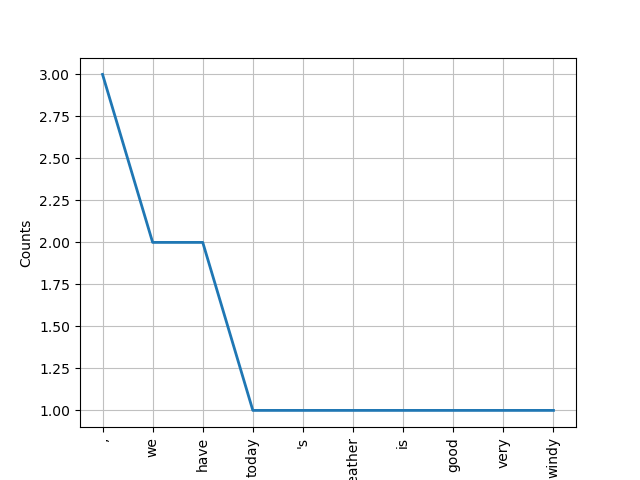
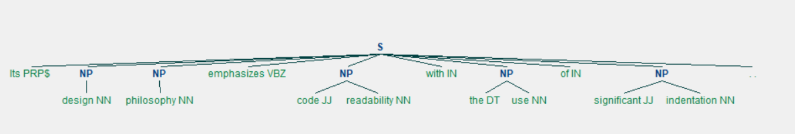
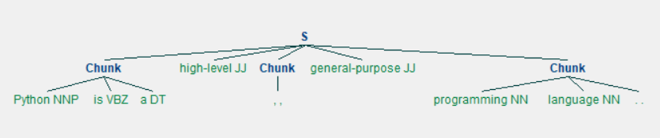
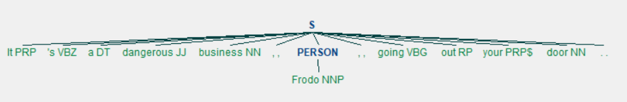
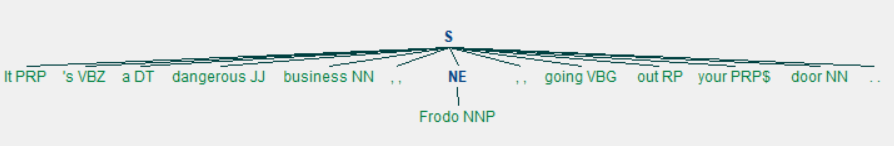
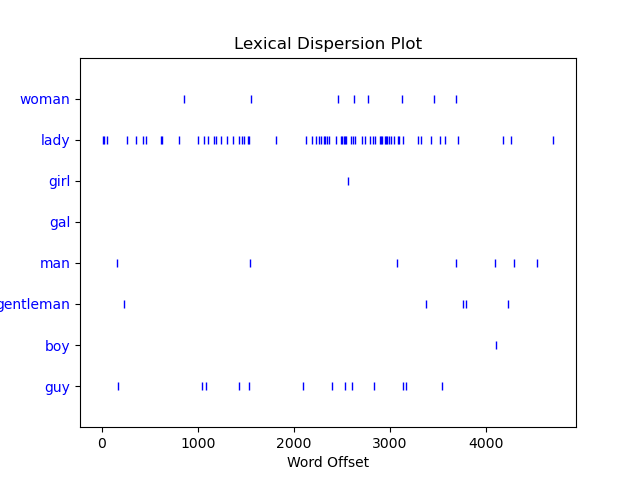
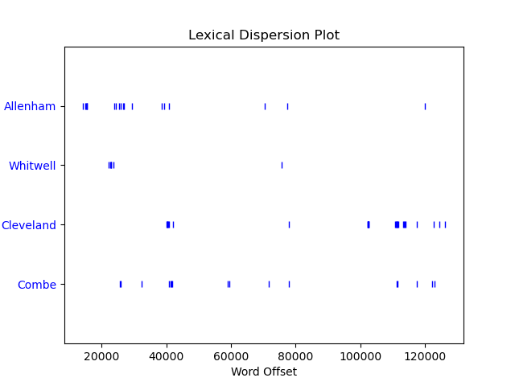
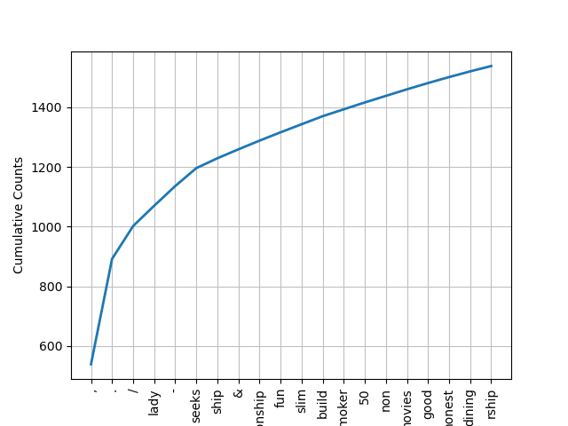

## Natural Language Toolkit(NLTK)简介

### NLTK安装与下载

&emsp;&emsp; 自然语言处理(NLP) 是一个专注于使计算机程序可以使用自然人类语言的领域。Natural Language Toolkit(NLTK)是可用于 NLP 的 Python包。NLTK是构建Python程序以使用人类语言数据的领先平台。它为50多种语料库和词汇资源（如WordNet）提供了易于使用的界面，还提供了一套用于分类，标记化，词干化，标记，解析和语义推理的文本处理库。NLTK是Python上著名的⾃然语⾔处理库⾃带语料库，具有词性分类库⾃带分类，分词，等等功能。NLTK被称为“使用Python进行教学和计算语言学工作的绝佳工具”，以及“用自然语言进行游戏的神奇图书馆”。使用`pip install nltk`安装NLTK包，进入Python命令行，使用`import nltk，nltk.download()`下载相关依赖文件。

### NLTK分词

&emsp;&emsp; 通过分词，我们可以方便地按单词或按句子分割文本，这是将非结构化数据转换为更易于分析的结构化数据的第一步。NLTK支持两种切分方法：

* **按单词切分：** 以单词作为最小切分单位对输入文本进行切分；
* **按句子切分：** 以一句话作为最小切分单位对输入文本进行切分。

&emsp;&emsp; 我们通过NLTK中的分词函数`sent_tokenize`和`word_tokenize`对输入文本进行切分：

```python
from nltk.tokenize import sent_tokenize, word_tokenize

example_string = "Python is a high-level, general-purpose programming language. Its design philosophy emphasizes code readability with the use of significant indentation."
sent_list = sent_tokenize(example_string)
word_list = word_tokenize(example_string)
```

&emsp;&emsp; 输出结果如下：

```
按句子切分：
['Python is a high-level, general-purpose programming language.',
 'Its design philosophy emphasizes code readability with the use of significant indentation.']

按单词切分：
['Python',
 'is',
 'a',
 'high-level',
 ',',
 'general-purpose',
 'programming',
 'language',
 '.',
 'Its',
 'design',
 'philosophy',
 'emphasizes',
 'code',
 'readability',
 'with',
 'the',
 'use',
 'of',
 'significant',
 'indentation',
 '.']
```

&emsp;&emsp; 我们还可以对文本分词的结果进行词频统计与绘制：

```python
from nltk.text import Text
from nltk.tokenize import word_tokenize

example_string = "Today's weather is good, very windy and sunny, we have no classes in the afternoon,We have to play basketball tomorrow."
word_list = [w.casefold() for w in word_tokenize(example_string)]
t = Text(word_list)
t.plot(10)
```

&emsp;&emsp; 输出结果如下：


&emsp;&emsp; 此外，对于输入的一段文本，并不是所有的词都值得我们关注，因为文本中会出现很多常见但是没有给文本增加很多意义的词，如'in','is'和'an'等。这些词被称为停用词（stopwords），我们在处理文本时通常需要将这些词过滤掉。NLTK提供了常见的停用词集合，我们可以方便地调用：

```python
from nltk.corpus import stopwords

stopwords.words("english")[:10]
```

&emsp;&emsp; 输出结果如下：

```
['i', 'me', 'my', 'myself', 'we', 'our', 'ours', 'ourselves', 'you', "you're"]
```

&emsp;&emsp; 我们可以进一步对输入文本进行停用词过滤：

```python
from nltk.corpus import stopwords
from nltk.tokenize import sent_tokenize, word_tokenize

example_string = "Python is a high-level, general-purpose programming language."
word_list = word_tokenize(example_string)

stop_words = set(stopwords.words("english"))

filtered_list = [word for word in word_list if word.casefold() not in stop_words]
print(word_list)
print(filtered_list)
```

&emsp;&emsp; 输出结果如下：

```
过滤前：['Python', 'is', 'a', 'high-level', ',', 'general-purpose', 'programming', 'language', '.']
过滤后：['Python', 'high-level', ',', 'general-purpose', 'programming', 'language', '.']
```

&emsp;&emsp; 可以看出过滤停用词的输出结果保留了输入文本的主干内容，去除了一些意义不大的词。

### NLTK词干提取

&emsp;&emsp;词干提取是一项文本处理任务，可以将输入文本中的单词简化为词根，这是词的核心部分。例如，单词“helping”和“helper”共享词根“help”。词干提取允许我们只保留词的核心部分，去除一些冗余的细节信息。NLTK提供了多个词干分析器，例如Porter词干分析器`PorterStemmer`：

```python
from nltk.stem import PorterStemmer

example_words = ["python", "pythoner", "pythoning", "pythoned", "pythonly"]
stemmer = PorterStemmer()
stemmed_words = [stemmer.stem(word) for word in example_words]
print(stemmed_words)
```

&emsp;&emsp; 输出结果如下：

```
['python', 'python', 'python', 'python', 'pythonli']
```

&emsp;&emsp; 此外，NLTK还提供了词性还原的类`WordNetLemmatizer`，例如将名词的复数形式还原，将动词的进行时，过去式和过去分词等形式还原:

```python
from nltk.stem import WordNetLemmatizer

example_words = ["scarves", "books"]
lemmatizer = WordNetLemmatizer()
lemmatized_words = [lemmatizer.lemmatize(word) for word in example_words]
print(lemmatized_words)
example_words = ["lost", "running"]
lemmatized_words = [lemmatizer.lemmatize(word, pos='v') for word in example_words]
print(lemmatized_words)
example_words = ["worst", "oldest"]
lemmatized_words = [lemmatizer.lemmatize(word, pos='a') for word in example_words]
print(lemmatized_words)
```

&emsp;&emsp; 输出结果如下：

```
['scarf', 'book']
['lose', 'run']
['bad', 'old']
```

### NLTK词性标注

&emsp;&emsp; NLTK模块可以完成词性标注任务，即将一个句子中的单词标注为名词，形容词，动词等。NLTK模块中将词性进行了仔细的划分：

```
...
CC: conjunction, coordinating
    & 'n and both but either et for less minus neither nor or plus so
    therefore times v. versus vs. whether yet
CD: numeral, cardinal
    mid-1890 nine-thirty forty-two one-tenth ten million 0.5 one forty-
    seven 1987 twenty '79 zero two 78-degrees eighty-four IX '60s .025
    fifteen 271,124 dozen quintillion DM2,000 ...
DT: determiner
    all an another any both del each either every half la many much nary
    neither no some such that the them these this those
EX: existential there
    there
FW: foreign word
    gemeinschaft hund ich jeux habeas Haementeria Herr K'ang-si vous
    lutihaw alai je jour objets salutaris fille quibusdam pas trop Monte
    terram fiche oui corporis ...
...
```

&emsp;&emsp; 我们使用NLTK内置词性标注函数`nltk.pos_tag()`对输入文本进行标注，并返回词语和词性构成的两元组：

```python
import nltk
from nltk.tokenize import word_tokenize

example_string = "Python is a high-level, general-purpose programming language."
word_list = word_tokenize(example_string)
pos_tag = nltk.pos_tag(word_list)
print(pos_tag)
```

&emsp;&emsp; 输出结果如下：

```
[('Python', 'NNP'), ('is', 'VBZ'), ('a', 'DT'), ('high-level', 'JJ'), (',', ','), ('general-purpose', 'JJ'), ('programming', 'NN'), ('language', 'NN'), ('.', '.')]
```

### NLTK分块

&emsp;&emsp;前面提及的分词可以实现对于单词和句子的识别，但是分块操作可以达到识别短语的目的。短语是作为单个单元执行语法功能的一个词或一组词。名词短语是围绕名词构建的。分块利用词性标注的标签对单词进行分组并将块标签应用于这些组。块不重叠，因此一个单词的一个实例一次只能在一个块中。为了分块，首先需要定义一个分块语法。块语法是关于如何将句子分块的规则的组合，经常使用正则表达式：

```python
import nltk
from nltk.tokenize import word_tokenize

example_string = "Its design philosophy emphasizes code readability with the use of significant indentation."
word_list = nltk.pos_tag(word_tokenize(example_string))
grammar = "NP: {<DT>?<JJ>*<NN>}"
chunk_parser = nltk.RegexpParser(grammar)
tree = chunk_parser.parse(word_list)
tree.draw()
```

&emsp;&emsp; 输出结果如下，可以看出该分块语法将文本中的所有名词短语提取出来，并且标记为"NP"：


&emsp;&emsp; 分块可以将满足特定语法的短语提取出来，相反如果我们希望删除特定形式的短语，则可以进行与分块类似的操作：添加间隙，通过相同的方式创建语法来确定在块中包含和排除那些部分：

```python
import nltk
from nltk.tokenize import word_tokenize

example_string = "Python is a high-level, general-purpose programming language."
word_list = nltk.pos_tag(word_tokenize(example_string))
grammar = "Chunk: {<.*>+}\n}<JJ>{"
chunk_parser = nltk.RegexpParser(grammar)
tree = chunk_parser.parse(word_list)
tree.draw()
```

&emsp;&emsp; 输出结果如下，可以看出该分块语法排除了文本中的所有形容词，将保留部分标记为"chunk"：


### NLTK命名实体识别

&emsp;&emsp; 命名实体是指特定位置、人员、组织等的名词短语。通过命名实体识别，我们可以在文本中找到命名实体，并确定它们是什么类型的命名实体。`nltk.ne_chunk()`函数用于识别输入文本中的命名实体，其中参数设置`binary=True`表明只想知道命名实体是什么但不知道它们是什么类型的命名实体，而默认参数`binary=False`会识别并对命名实体进行分类：

```python
import nltk
from nltk.tokenize import word_tokenize

example_string = "It's a dangerous business, Frodo, going out your door."
word_list = nltk.pos_tag(word_tokenize(example_string))
tree = nltk.ne_chunk(word_list)
tree.draw()
tree = nltk.ne_chunk(word_list, binary=True)
tree.draw()
```

&emsp;&emsp; 默认参数`binary=False`的输出结果如下，可以看出命名实体识别将文本中的人名筛选了出来，并给出"Person"的标签：

&emsp;&emsp; 设置参数`binary=True`的输出结果如下，可以看出同样识别出了文本中的人名，但是没有仔细分类，只是给出"NE"的标签：


&emsp;&emsp; 此外，我们还可以利用该函数实现对文本内容所有命名实体的抽取：

```python
import nltk
from nltk.tokenize import word_tokenize


def extract_ne(text):
    tags = nltk.pos_tag(word_tokenize(text))
    tree = nltk.ne_chunk(tags)
    return [(" ".join(i[0] for i in t), t.label()) for t in tree if hasattr(t, "label")]


text = """
Men like Schiaparelli watched the red planet—it is odd, by-the-bye, that
for countless centuries Mars has been the star of war—but failed to
interpret the fluctuating appearances of the markings they mapped so well.
All that time the Martians must have been getting ready.

During the opposition of 1894 a great light was seen on the illuminated
part of the disk, first at the Lick Observatory, then by Perrotin of Nice,
and then by other observers. English readers heard of it first in the
issue of Nature dated August 2."""

print(extract_ne(text))
```

&emsp;&emsp; 输出结果如下：

```
[('Schiaparelli', 'PERSON'), ('Mars', 'PERSON'), ('Lick Observatory', 'ORGANIZATION'), ('Perrotin', 'PERSON'), ('Nice', 'GPE'), ('Nature', 'PERSON')]
```

### NLTK语料库

&emsp;&emsp; NLTK模块不仅仅提供了上述各类实用的工具，而且包含了一部分小型语料库以供使用：

```
*** Introductory Examples for the NLTK Book ***
Loading text1, ..., text9 and sent1, ..., sent9
Type the name of the text or sentence to view it.
Type: 'texts()' or 'sents()' to list the materials.
text1: Moby Dick by Herman Melville 1851
text2: Sense and Sensibility by Jane Austen 1811
text3: The Book of Genesis
text4: Inaugural Address Corpus
text5: Chat Corpus
text6: Monty Python and the Holy Grail
text7: Wall Street Journal
text8: Personals Corpus
text9: The Man Who Was Thursday by G . K . Chesterton 1908
```

&emsp;&emsp; 我们可以使用内置函数，便捷的对这些语料数据进行相关统计分析，索引操作`.concordance()`可以看到每次使用一个词，以及它的直接上下文，从而了解一个单词在句子级别的使用方式以及与它一起使用的单词：

```python
from nltk.book import *

text8.concordance("man")
```

&emsp;&emsp; 输出结果如下，返回结果找到文本中所有出现"man"的地方，并展示部分上下文：

```
Displaying 14 of 14 matches:

 to hearing from you all . ABLE young man seeks , sexy older women . Phone for 
ble relationship . GENUINE ATTRACTIVE MAN 40 y . o ., no ties , secure , 5 ft .
ship , and quality times . VIETNAMESE MAN Single , never married , financially 
ip . WELL DRESSED emotionally healthy man 37 like to meet full figured woman fo
 nth subs LIKE TO BE MISTRESS of YOUR MAN like to be treated well . Bold DTE no
eeks lady in similar position MARRIED MAN 50 , attrac . fit , seeks lady 40 - 5
eks nice girl 25 - 30 serious rship . Man 46 attractive fit , assertive , and k
 40 - 50 sought by Aussie mid 40s b / man f / ship r / ship LOVE to meet widowe
discreet times . Sth E Subs . MARRIED MAN 42yo 6ft , fit , seeks Lady for discr
woman , seeks professional , employed man , with interests in theatre , dining 
 tall and of large build seeks a good man . I am a nonsmoker , social drinker ,
lead to relationship . SEEKING HONEST MAN I am 41 y . o ., 5 ft . 4 , med . bui
 quiet times . Seeks 35 - 45 , honest man with good SOH & similar interests , f
 genuine , caring , honest and normal man for fship , poss rship . S / S , S / 
```

&emsp;&emsp; 我们还可以使用散布图查看特定单词出现的次数和出现的位置。在分析单个文本时，这可以帮助我们查看哪些单词彼此靠近。在分析按时间顺序组织的文本语料库，它可以帮助我们了解在一段时间内或多或少地使用了哪些单词。

```python
from nltk.book import *

text8.dispersion_plot(
    ["woman", "lady", "girl", "gal", "man", "gentleman", "boy", "guy"]
)
text2.dispersion_plot(["Allenham", "Whitwell", "Cleveland", "Combe"])
```

&emsp;&emsp; 输出结果如下，每条垂直的蓝线代表一个单词的一个实例，每一行水平的蓝线代表整个语料库：



&emsp;&emsp; 通过频率分布，我们还可以检查文本中出现频率最高的单词：

```python
from nltk.book import *

frequency_distribution = FreqDist(text8)
print(frequency_distribution.most_common(20))
```

&emsp;&emsp; 输出结果如下：

```
[(',', 539), ('.', 353), ('/', 110), ('for', 99), ('and', 74), ('to', 74), ('lady', 68), ('-', 66), ('seeks', 60), ('a', 52), ('with', 44), ('S', 36), ('ship', 33), ('&', 30), ('relationship', 29), ('fun', 28), ('in', 27), ('slim', 27), ('build', 27), ('o', 26)]
```

&emsp;&emsp; 可以看出大部分频率较高的单词都是没有具体含义的停用词，从而出现频率较高的单词无法提供与文本相关的详细信息。因此，我们需要首先对文本进行停用词过滤再进行词频统计：

```python
from nltk.book import *
from nltk.corpus import stopwords

stop_words = set(stopwords.words("english"))
meaningful_words = [
    word for word in text8 if word.casefold() not in stop_words
]
frequency_distribution = FreqDist(meaningful_words)
print(frequency_distribution.most_common(20))
frequency_distribution.plot(20, cumulative=True)
```

&emsp;&emsp; 输出结果如下：
```
[(',', 539), ('.', 353), ('/', 110), ('lady', 68), ('-', 66), ('seeks', 60), ('ship', 33), ('&', 30), ('relationship', 29), ('fun', 28), ('slim', 27), ('build', 27), ('smoker', 23), ('50', 23), ('non', 22), ('movies', 22), ('good', 21), ('honest', 20), ('dining', 19), ('rship', 18)]
```
